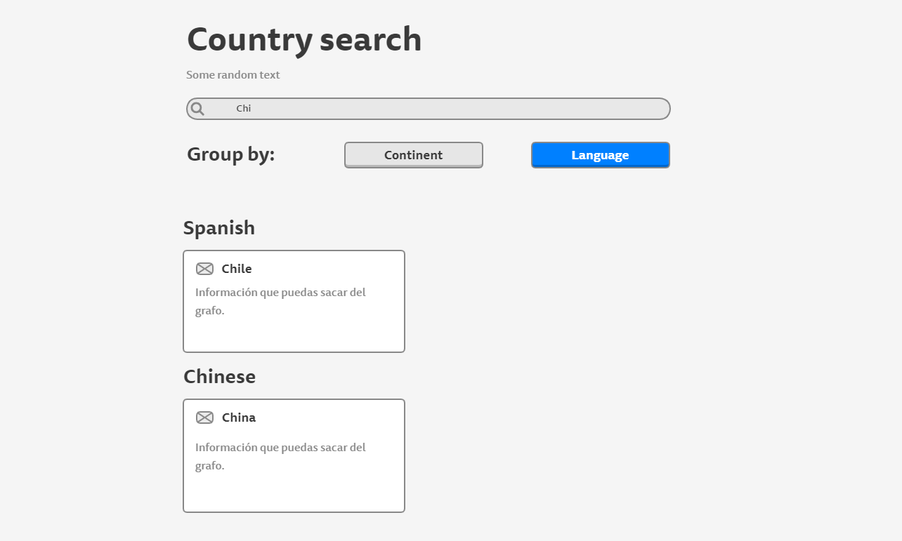

# Desafío para Software Engineers

Nombre postulante: Emiliano Acevedo Felip

Link a la app en producción: [Netlify](https://kimche-challenge-eaf.netlify.app/)

## Respuesta del desafío

Para mi respuesta estoy asumiendo que el tiempo que se busca optimizar se basa sobre un INSERT statment, ya que el tiempo transcurrido es a partir de que se toma y registra la asistencia.

Para mejorar este tiempo de respuesta tenemos dos sendas:

### 1. Hardware:

Aunque sea obvio, no está de más plantear la idea de mejorar el Hardware que interactúa con la DB. Para esto se debería considerar:

1. Almacenamiento: ¿Las unidades de almacenamiento están al día con el hardware moderno?, La velocidad de escritura de los discos es un punto a considerar.
2. CPU y Memoria: Es posible que la CPU se esté quedando corta con la memoria, generando cuellos de botella.

Cambiar el hardware siempre es costoso y es probable que la empresa ni siquiera tenga el suyo propio. Para esto necesitamos ir a la segunda opción.

### 2. Database:

En primera instancia, es vital que para enviar los datos de la asistencia estos se hagan en una única operación y conexión, por lo que se puede revisar la lógica del back para ver si este está acorde a esta premisa. Por otra parte, el tamaño de las tablas demora la inserción de datos, por lo que una alternativa a tener es plantearse si la tabla tiene sentido según las operaciones que se realicen con ella. Por ejemplo, tener una tabla de asistencia histórica puede ser una mala idea para trabajar la asistencia, que solo tiene un impacto anual por lo general. Así mismo, puede que trabajar con una tabla de asistencia anual por curso haga que la tabla sea más pequeña y rápida en sus respuestas. 

Por último, propondría que el sistema tuviera un valor default para la asistencia, y la forma de registro sea exclusivamente por marcar inasistencias (que como suelen ser menores que las asistencias, la experiencia de usuario sería más rápida al sólo marcar los alumnos faltantes). Para graficar esto, dejo un bloque de código:

```
CREATE TABLE first_grade_2022_attendances (
  alumn_id INTEGER FOREIGN KEY,
  date DATE DEFAULT now(),
  attendance BOOLEAN DEFAULT true
);
```

Cada planteamiento se basa directamente en la documentación de MySQL. Para mayor detalle visitar:

1. [Optimization Overview](https://dev.mysql.com/doc/refman/5.7/en/optimize-overview.htm)
2. [Optimizing INSERT Statements](https://dev.mysql.com/doc/refman/5.7/en/insert-optimization.html#:~:text=To%20optimize%20insert%20speed%2C%20combine%20many%20small%20operations,updates%20and%20consistency%20checking%20until%20the%20very%20end.)

## Instrucciones

Debes crear un buscador de países consultando el [siguiente grafo](https://countries.trevorblades.com/). Este código contiene una base para seguir con la aplicación en React y ApolloClient. Queda a disposición tuya cualquier cambio, ya sea de estructura, estilo, etc.

Se espera que logres hacer una aplicación parecida a la del siguiente diagrama:




La funcionalidad y estructura debe ser igual, pero el diseño y variantes (por ejemplo, cambiar colores de las cosas) queda a tu gusto. **Considerar que el ícono al lado del nombre de cada país es el emoji**.

Además de esto, se espera que hagas deploy de tu app en el servicio que desees (Heroku, Netlify, AWS, Github Pages, etc).

## Consideraciones

- Se espera que uses buenas prácticas como gitflow (pull requests y commits), orden del código, estructura, eficiencia, etc.
- Puedes dejar comentarios de decisiones que tuviste que tomar y del por qué en este repositorio.
- Se va a considerar un buen diseño de UX/UI.

## Hints

Acá van algunas cosas que pueden ser útiles (o no 👀):

- [Gitignore](https://www.toptal.com/developers/gitignore)
- [GraphQL](https://www.howtographql.com/)
- [React](https://es.reactjs.org/)
- [Styled components](https://styled-components.com/docs/basics)
- [ApolloClient](https://www.apollographql.com/docs/react/)
- [Lodash](https://lodash.com/)
- [Conventional commits](https://www.conventionalcommits.org/en/v1.0.0/)
- [Commitlint](https://commitlint.js.org/#/)
- [Eslint](https://eslint.org/)
- [Eslint airbnb](https://www.npmjs.com/package/eslint-config-airbnb)
- [Husky](https://www.npmjs.com/package/husky)
